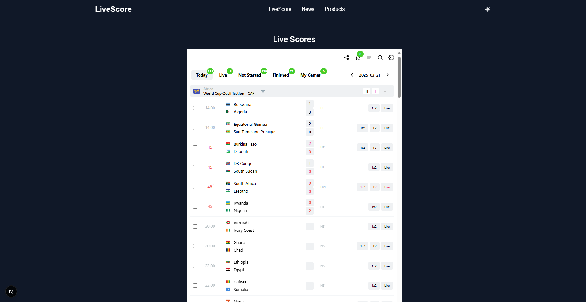

# LiveScore - Football News and Scores Application

A modern web application built with Next.js that provides real-time football scores and news updates. The application features a clean, responsive design with dark mode support.

## Features

- 📰 Latest football news from reliable sources
- ⚽ Real-time football scores
- 🌓 Dark/Light mode support
- 📱 Responsive design for all devices
- 🚀 Fast and optimized performance

## Screenshots

### Home Page



### News Section


### Products Section


## Tech Stack

- **Framework**: Next.js 14
- **Language**: TypeScript
- **Styling**: Tailwind CSS
- **Font**: Geist Sans
- **API**: NewsAPI for football news

## Getting Started

1. Clone the repository:

```bash
git clone [repository-url]
cd score
```

2. Install dependencies:

```bash
npm install
# or
yarn install
# or
pnpm install
```

3. Set up environment variables:

   - Copy `.env.example` to `.env`
   - Add your NewsAPI key to the `.env` file

4. Run the development server:

```bash
npm run dev
# or
yarn dev
# or
pnpm dev
```

Open [http://localhost:3000](http://localhost:3000) with your browser to see the result.

## Project Structure

```
score/
├── src/
│   ├── app/              # Next.js app directory
│   ├── components/       # Reusable components
│   └── styles/          # Global styles
├── public/              # Static assets
├── images/             # Project screenshots
└── ...config files
```

## Environment Variables

Create a `.env` file in the root directory with the following variables:

```env
NEWS_API_KEY=your_news_api_key_here
```

## Contributing

Contributions are welcome! Please feel free to submit a Pull Request.

## License

This project is licensed under the MIT License - see the LICENSE file for details.

## Acknowledgments

- [Next.js](https://nextjs.org/) - The React framework for production
- [NewsAPI](https://newsapi.org/) - For providing football news data
- [Tailwind CSS](https://tailwindcss.com/) - For styling
- [Geist Font](https://vercel.com/font) - For typography

## Learn More

To learn more about Next.js, take a look at the following resources:

- [Next.js Documentation](https://nextjs.org/docs) - learn about Next.js features and API.
- [Learn Next.js](https://nextjs.org/learn) - an interactive Next.js tutorial.

You can check out [the Next.js GitHub repository](https://github.com/vercel/next.js) - your feedback and contributions are welcome!

## Deploy on Vercel

The easiest way to deploy your Next.js app is to use the [Vercel Platform](https://vercel.com/new?utm_medium=default-template&filter=next.js&utm_source=create-next-app&utm_campaign=create-next-app-readme) from the creators of Next.js.

Check out our [Next.js deployment documentation](https://nextjs.org/docs/app/building-your-application/deploying) for more details.
"# livescore"
